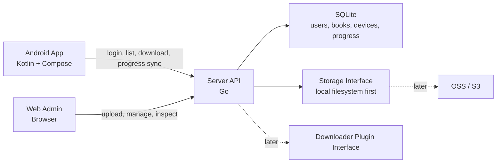

# BOOX Books Sync Next MVP Design

Date: 2026-07-04

## 1. Background

The current `amwangfan/boox-books-sync` project is a BOOX-oriented Magisk module that uses shell scripts and rclone/WebDAV-style synchronization. It works well as a device-side sync tool, but the next version should become a normal application system:

- a server stores books, metadata, reading progress, and future download-plugin outputs;
- a web admin UI manages the library and server state;
- an Android app downloads EPUBs from the server, stores them locally, and acts as a simple reader;
- root and non-root Android behavior are intentionally the same in the MVP, with root-specific optimization left for later.

This new repository should not depend on the old plugin shape, but it should preserve the useful product lessons from it:

- BOOX-first usage;
- safe sync semantics;
- simple deployment and operations;
- no accidental deletion of book files;
- clear logs and inspectable state.

## 2. MVP goals

The MVP is a single-user system with these capabilities:

1. Server
   - Runs as a lightweight self-hosted service.
   - Stores EPUB files on local disk.
   - Stores metadata, devices, sessions, and progress in SQLite.
   - Provides authenticated REST APIs under `/api/v1`.
   - Provides a browser-based admin UI.
   - Reserves clean interfaces for future OSS/S3 storage and downloader plugins.

2. Web admin
   - Login with administrator username and password.
   - Upload EPUB files.
   - List/search books.
   - View book metadata and file status.
   - Delete/archive books through explicit user action.
   - View known Android devices and latest reading progress.

3. Android app
   - Native Kotlin app using Jetpack Compose.
   - Login to one configured server.
   - List server books.
   - Pull/download EPUB files to local app storage.
   - Open EPUBs in a simple in-app reader.
   - Track local reading progress and upload it to the server.
   - Sync on app startup, periodic WorkManager schedule, and manual user action.

4. Deployment/demo
   - The experimental server can run on the remote Aliyun host.
   - The deployment must be small, easy to inspect, and fully removable.
   - Prefer one server binary plus one data directory.
   - Avoid Docker for the MVP because the target host currently does not have Docker and has limited memory.

## 3. Explicit non-goals for MVP

- Multi-user library sharing.
- Public anonymous book downloads.
- Complex permission models.
- Root-only BOOX optimizations.
- PDF/MOBI/AZW3 reading.
- Annotation sync.
- Full-text search.
- Sophisticated conflict resolution.
- Production-grade external object storage.
- Downloader plugin implementation.
- Push notifications or always-running Android foreground service.

## 4. Architecture



## 5. Technology choices

### Server

Use Go for the server.

Reasons:

- low memory footprint for the Aliyun server;
- simple static-ish deployment;
- easy to run as a single systemd service;
- good SQLite and HTTP ecosystem;
- better fit than a JVM server on the current small remote host.

Server components:

- HTTP router and middleware;
- SQLite data layer;
- local filesystem storage adapter;
- authentication/session service;
- sync service;
- static web admin asset serving;
- structured logs.

### Web admin

Start with an embedded web UI served by the Go binary.

The UI can be implemented with a lightweight frontend stack. The key MVP constraint is operational simplicity: one server process should serve both API and web admin.

### Android

Use native Kotlin and Jetpack Compose.

MVP modules should be separable enough to support future migration or reuse:

- API client;
- auth/session store;
- local book repository;
- sync coordinator;
- reader screen;
- progress tracker.

The reader starts simple and EPUB-only. A richer Readium-based implementation can replace or extend the simple reader later.

## 6. Authentication model

Even though the MVP is single-user, all book APIs are authenticated.

- Web admin uses administrator username/password login.
- Android uses the same account to obtain:
  - short-lived access token;
  - refresh token.
- Book metadata and file downloads require authentication.
- The server does not expose anonymous EPUB download URLs.

Initial bootstrap may use environment variables or a first-run setup command to create the administrator account.

## 7. Storage model

The MVP stores files locally, but all file operations go through a storage interface.

Initial local layout:

```text
data/
  app.db
  books/
    <book-id>/
      original.epub
      cover.jpg
      metadata.json
  tmp/
  logs/
```

The storage interface should support:

- save uploaded book;
- open/read book stream;
- delete/archive book object;
- check object existence;
- calculate file size and checksum;
- generate internal storage keys.

Future adapters:

- Aliyun OSS;
- S3-compatible storage;
- remote cache layer if needed.

## 8. Core data model

Minimum SQLite tables:

- `users`
  - single admin account for MVP;
  - password hash;
  - created/updated timestamps.

- `sessions`
  - refresh token hash;
  - device/client label;
  - expiry/revocation state.

- `books`
  - id;
  - title;
  - author;
  - format;
  - storage key;
  - file size;
  - checksum;
  - cover key;
  - created/updated timestamps;
  - archived/deleted state.

- `devices`
  - id;
  - display name;
  - platform;
  - last seen timestamp.

- `reading_progress`
  - book id;
  - device id;
  - progress locator;
  - percentage if available;
  - updated timestamp.

Progress conflict policy for MVP:

- last-write-wins;
- include timestamp and device id for transparency;
- keep the schema ready for later conflict history if needed.

## 9. REST API shape

Version all APIs under `/api/v1`.

Initial endpoints:

```text
POST   /api/v1/auth/login
POST   /api/v1/auth/refresh
POST   /api/v1/auth/logout
GET    /api/v1/me

GET    /api/v1/books
POST   /api/v1/books
GET    /api/v1/books/{bookId}
GET    /api/v1/books/{bookId}/download
DELETE /api/v1/books/{bookId}

GET    /api/v1/books/{bookId}/progress
PUT    /api/v1/books/{bookId}/progress

GET    /api/v1/devices
PUT    /api/v1/devices/current
```

Admin-only endpoints can share the same single-user authorization in MVP. When multi-user support is added, authorization can split into roles.

## 10. Android sync behavior

Initial sync triggers:

- app startup;
- manual sync button;
- periodic WorkManager background sync.

Initial sync direction:

- server to Android:
  - book list;
  - book metadata;
  - missing EPUB files;
  - latest server progress.
- Android to server:
  - current device info;
  - local reading progress.

Deletion behavior:

- MVP should not silently delete local books because the legacy project valued safe sync behavior.
- If a book is archived/deleted on the server, the Android app should mark it as unavailable and ask before removing the local file.

## 11. Reader MVP

EPUB-only.

Required:

- open downloaded EPUB;
- show title/author if available;
- display readable chapter content;
- basic table of contents if available;
- next/previous chapter navigation;
- persist local reading position;
- upload progress on close/background/manual sync.

Deferred:

- annotations;
- highlights;
- dictionary integration;
- text-to-speech;
- advanced typography;
- Readium-level locator fidelity;
- PDF/MOBI/AZW3 rendering.

## 12. Server deployment plan

For the Aliyun experimental deployment:

```text
/opt/boox-books-sync-next/
  boox-server
  data/
  config.env
```

Operational constraints:

- keep the binary and data directory small;
- use SQLite and local disk;
- no Docker dependency in MVP;
- expose the web UI either through an SSH tunnel or a temporary authenticated HTTP port;
- provide a single documented removal command that stops the service and removes `/opt/boox-books-sync-next`.

Preferred demo access:

- run the service on the server;
- open the web admin locally through SSH port forwarding when possible;
- only expose a public port if explicitly needed.

## 13. Repository layout

Planned layout after implementation begins:

```text
server/
  cmd/boox-server/
  internal/
    auth/
    books/
    config/
    db/
    httpapi/
    storage/
    sync/
  web/
  migrations/

android/
  app/
  core/
    api/
    data/
    sync/
    reader/

docs/
  design/
  plans/
```

The initial design document is intentionally committed before implementation. Implementation should proceed from a written plan and tests.

## 14. Testing strategy

Server:

- unit tests for storage interface, auth token lifecycle, metadata parsing, and sync policy;
- API handler tests for authenticated and unauthenticated access;
- migration tests for SQLite schema;
- small integration test using temporary local storage.

Android:

- unit tests for API client models, local repository, and sync coordinator;
- Compose UI smoke tests where practical;
- reader progress tests with fixture EPUBs.

End-to-end:

- upload EPUB through web/API;
- Android/client downloads it;
- client updates progress;
- web admin shows latest progress.

## 15. First implementation slice

The first code slice should be deliberately narrow:

1. Server boots with config and SQLite.
2. Admin user can log in.
3. Authenticated web/API upload of one EPUB works.
4. Book list and download endpoints work.
5. Android can log in, list books, download an EPUB, and open a simple reader screen.
6. Progress can be saved locally and uploaded to the server.
7. Remote demo can run on Aliyun and be removed cleanly.

## 16. Open decisions before public GitHub creation

- Final public repository name.
- Whether the first remote demo should use SSH tunnel only or expose a temporary HTTP port.
- Whether the web admin should be plain server-rendered HTML first or a bundled SPA.

